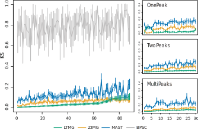

# LTMGSCA

This repository contains the R codes which could reproduce the results of "LTMG: A statistical model of transcriptional regulatory states in single cell RNA-Seq data" by Changlin Wan, Wennan Chang, Yu Zhang, Fenil Shah, Sha Cao, Melissa L. Fishel, Qin Ma, and Chi Zhang.

LTMGSCA is a left truncated mixture Gaussian (LTMG) model-based single cell RNA-seq analysis pipeline that can accurately infer the modality and distribution of individual gene’s expression profile in scRNA-seq data, while decrease the impact from dropout and low expression value.  Enabled by LTMG, a differential expression test and a gene co-regulation module identification method, namely LTMG-DGE and LTMG-GCR, are further developed and incorporated within the framework.


We compared LTMG with other state-of-art scRNA-seq models on a comprehensive set of human scRNA-seq data. LTMG in general achieved best goodness of fitting among them (lower KS value means better fitting performance). More detailed illustration could be found at https://www.biorxiv.org/content/early/2018/09/29/430009.




## Installation

To install the `LTMGSCA` demonstration package, you will need to install the release version of `devtools` from CRAN with 

```{r}
install.packages("devtools")
```

Then,
```{r}
devtools::install_github("zy26/LTMGSCA")
```

## Tutorial

To see the demonstration of LTMG - DEG track, please choose between [.md file](vignettes/deg_vignette.md) and [.pdf file](vignettes/deg_vignette.pdf).

To see the demonstration of LTMG - GCR track, please choose between [.md file](vignettes/gcr_vignette.md) and [.pdf file](vignettes/gcr_vignette.pdf).